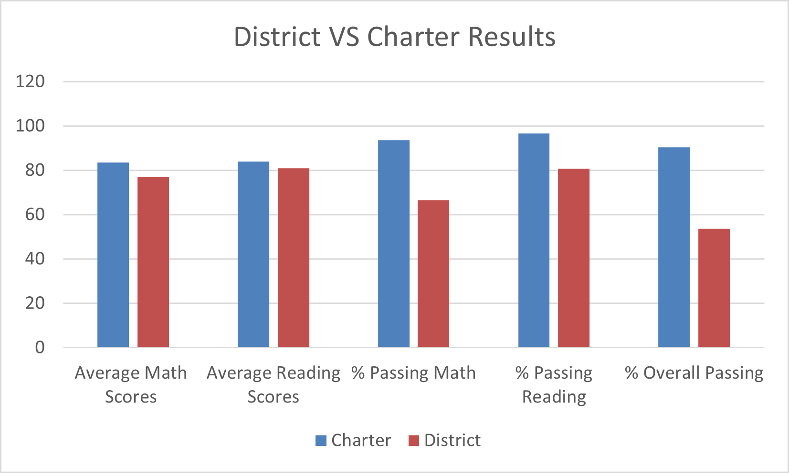

# pandas-challenge

# How to use Pandas  to read information from a CSV file, manipulate it, and return DataFrames: :cd:

In this project we will analyse a city future school budgets and priorities. That is why we will start by analyzing the district-wide standardized test results, then we will aggregate the data to showcase obvious trends in school performance with the access to a various information on the school

# What we will learn from this project:

    - How to create dataframes from an existent dataset
    - How to perform the necessary calculations and creat a high-level snapshot of the key metrics
    - how to filter, merge, sort, group and bin to enable more vigorous dataset customization
    - How to analyse the output Data to make the right decision
    
# Instructions:

#  Program:

### Tools: 
- Pandas which is a Python library for data manipulations and analysis
- Jupyter Notebook wich is a web-based interactive computing pltaform allows user to compile all aspects of a data project
   

### Analysis: budget_data.txt


### Python script: main.py
```
#loop in the file
    for row in csvreader:
       
        # net total amount
        net_amount = net_amount + float(row[1])
        
        #assign the value of each profit/losses and its date respectively to the lists a and c
        a.append(float(row[1]))  
        c.append(row[0])
    
    #assign the changes of each profit/losses and their dates respectively in list b and d
    for j in range (len(a)-1):
        
        x=((a[j+1]-a[j]))
        y=c[j+1]
        b.append((x))
        d.append(y)
        
    #calculate the average of the changes
    avg= sum(b)/len(b)

    max=max(b)
    min=min(b)
    pmax=b.index(max)
    pmin=b.index(min)
```

## PyBank:

### Resources: budget_data.csv


### Analysis: budget_data.txt


### Python script: main.py
```
#loop in the file
    for row in csvreader:
        
        #assign the value of names to the list a 
        a.append(row[2])  
    #sort the list a 
    a.sort()
    
    #fill the list b with condidate names without redundancy
    b.append(a[0])
    
    for i in range (len(a)-1):
        
        if a[i]!=a[i+1]:
            b.append(a[i+1])
            
    #count the number of votes for each candidate and save it in the list c        
    for i in range (len(b)):   
        l=0
        for j in range (len(a)): 
           if a[j]==b[i]:
               l=l+1
        c.append(l)
    
    #print the name of each candidate with the percentage of their votes and the total of their votes 
    for i in range (len(c)):
        print(b[i],':', round(c[i]/len(a)*100,3),'% (',c[i],')','\n')
    
    x=max(c)
    p=c.index(x)
```   
# Tip:🪄
  
Python offers huge libraries with multiple predefined functions and methods to facilitate programming. Here are some examples:
- len: Returns the length of a list
- sum: Returns the total of all elements in a list instead of a whole loop
- min and max: Return the minimum and the maximum values in a list
- index: Returns the value of an index in a list

--> Code to look for the maximum and its index in a list with loops:😒
```
    max=0
    pmax=0
    #look for the max in a list
    for j in range (len(b)):
        if b[j]> max:
            max=b[j]
            pmax=j  
   
    #look for the index of the max in a list
    h = 0
    stop= False
    while(stop==False) or (h>=len(b)):
        if h == pmax: 
            stop=True
        else: h=h+1
```
 --> Code to look for the maximum and its index in a list with the function max and the method index: 😊
 ```
     max=max(b)
     pmax=b.index(max)
 ```
- Sort(): Forget about sorting algorithms and how complicated they are! one simple call and your list is sorted! 😍


This analysis is for a city's school district to help the responsibles to make strategic decisions regarding future school budgets and priorities. That is why we will start by analyzing the district-wide standardized test results, then we will aggregate the data to showcase obvious trends in school performance With the access to a various information on the school

   1. District Summary: Performing the necessary calculations and creating a high-level snapshot of the district's key metrics:
    
        - Total number of unique schools

        - Total students

        - Total budget

        - Average test scores (Math and Reading)

        - Passing rates (Math, Reading and both)

     All these information will be used for a later deeper analysis   

   2. School Summary: Performing the necessary calculations and summarizing key metrics about each school:
        
        - Total student count per school

        - Total school budget and per capita spending per school

        - Average test scores per school (Math and Reading)

        - Passing rates (Math, Reading and both)

        - Associate all this information with the name and the type of each school    
        
   3. Sorting the information to organize and analyse Data in more efficient and meaningful way:

       - Sort the schools by the purcentage of Overall Passing to analyse the Highest-Performing Schools and the Lowest-Performing Schools 

   4. Placing values into groups to enable more vigorous dataset customization:

        - Scores by Grade: for students of each grade level (9th, 10th, 11th, 12th) at each school
        - Scores by School Spending: average spending ranges (per student)
        - Scores by School Size:  school performance based on school size (small, medium, or large)
        - Scores by School Type: school performance based on the type of the school

## Conclusions:

   ### District VS Charter
  
   
   - District schools are large schools without exception,they contien more than 2000 students.

   - Charter schools (except Wilson High School) are small and medium schools, contien  between less than 1000 and 2000 students.

   - District schools get higher budget

   - Charter schools get lower budget

--> The ratio Per Student Budget is not proportional

   - The purcentage of Overall passing for charter schools is obviously higher than district schools
    
    
   - The five first highest performing schools are charter schools
    
   - The five last bottom performing schools are district schools
    

   
    
    
#### Conclusions: The responsibles get involved more on less profitable schools


### Math VS Reading

   - The avarege per school Reading is higher than the avarege per school Math
    
   - The number of students per school with reading scores more than 70 is heigher than the number of students per school with Math scores more than 70 is heigher
    
   - The average of Reading Scores by Grade is much better than the average of Math Scores by Grades (for almost all grades)
    
   - The spending Reading scores is higher than spending Math Scores and consequently spending passing Reading is higher than spending passing Math
    
#### Conclusions: The responsibles get involved more on Reading than Math which negatively impacts on improving Math 

## Remediaiton:
